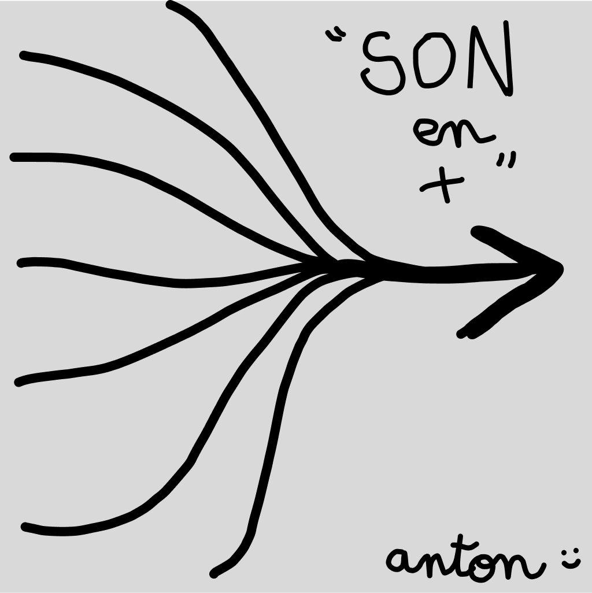

# SoundBαɒrd

  

> **SoundBαɒrd** est un routeur et mixeur audio léger conçu pour les créateurs de contenu.

Cette première itération, Luth, pose les bases de l'outil permettant de capturer, découper et diffuser du son en direct.

---

### Fonctionnalités
- **Routage audio intelligent** : Mixez votre microphone et vos sources secondaires avec fluidité.
- **Snipping express** : Enregistrez des extraits audio à la volée et découpez-les.
- **Double identité** : Basculez entre le thème **Classic neon** et le thème **Silver studio**.
- **Zéro latence** : Utilisation en direct sans décalage.

### Démarrage rapide
1. Téléchargez la dernière version sur la page [Releases](https://github.com/aent0n/soundboAArd/releases).
2. Lancez `SoundBαɒrd.exe`.
3. Configurez vos périphériques d'entrée et de sortie.